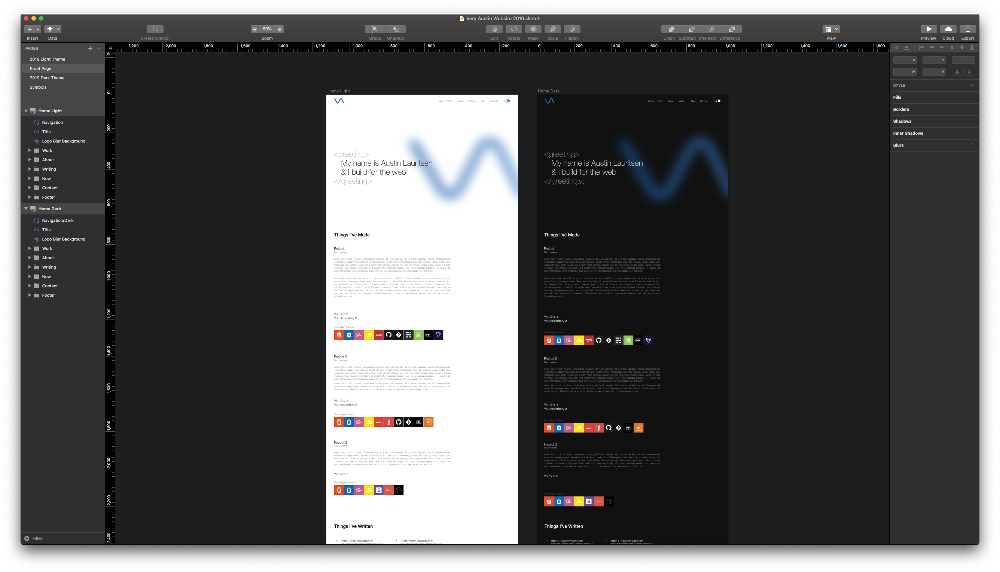
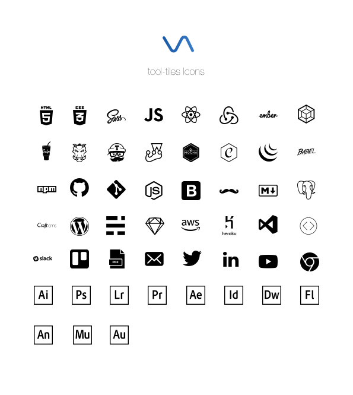
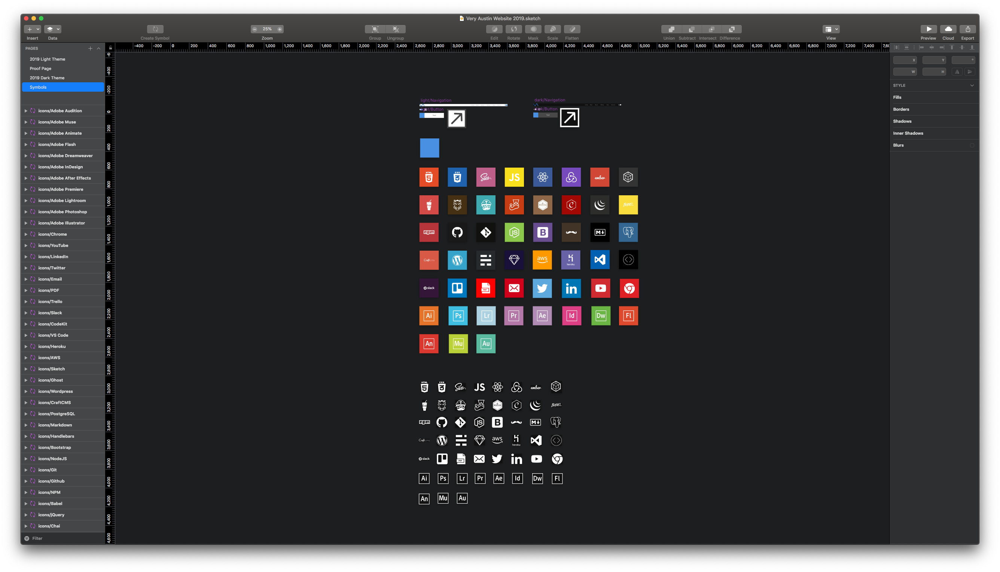

2019 is upon us fully aware that this post is in the first week of March. I meant to get the 2019 version of my website out the door on January 1 but client work, family events and a combination of learning/using several new technologies delayed that until now. I use this site as a playground to explore new technologies and learn something new. This year, I bit off a lot. My last site was built using React + Redux with a Firebase back-end. The back-end while a simple JSON store, wasn't user friendly to update so sadly, it never was. Fast forward to the middle of 2018, I came across Gatsby, a blazingly fast React + GraphQL static site generator. This sounded like the perfect solution as I could write my content in Markdown and if need be, connect it to a CMS down the road with the GraphQL data layer. I also wanted to use this project to explore CSSGrids as well as publish my first NPM package so lets talk about it.

## Design

This year I opted for an even more minimal design paying homage to the previous design by keeping the tiles, reminiscent of album artwork to add a splash of color. Since "Dark" themes seem to becoming more popular in operating systems & software, I decided it would be a fun challenge to include that the 2019 site as well.



[Sketch](https://www.sketchapp.com/) has several tools to organize & reuse design elements much in the same way you would use React components so I first created a set of proof sheet of icons that I would be including on the tiles.


The Icons were then imported to be used as symbols for each tile.


With the tiles completed, I designed the rest of the site, trying to keep it as clean and minimal as possible.

## Technology

### Gatsby
As mentioned in the beginning of this post, I opted to use Gatsby to power this site. When I initially started on this project, I was using Gatsby v1.x which was quite good but definitely had a few v1.x issues. One issue I ran into was that I wanted to use React 16.3 Context API take a stab at implementing the various "light" & "dark" themes by passing context down to components deep in the tree without having to prop drill. Unfortunately, by bumping the version of React that Gatsby used, required a newer version of Webpack than what shipped with Gatsby...welcome to dependancy hell. Since Gatsby was such a new project, while documentation was good, I was in bleeding edge territory and I still have a lot to learn about Webpack so it was quite painful. By the time I was able to return to this project, Gatsby had been bumped to v2.x with support for React 16.3 but changed the relationship between Layouts & Pages which additionally affected my ability to have a "Global State", keeping track of which theme was toggled. There have been a variety of issues which took significant time to lean and understand the specific ways in which the Gatsby tooling works and changed from v1 to v2. I think if I were to build another site on Gatsby again, I would feel more comfortable because it seems fleshed out than v1 (as expected) and feel like there are more answers in the community than early on in the project. I think I started working on this project during a perfect storm of transition in both React & Gatsby, making the waters a bit rougher than it might normally have been.

### GraphQL
Gatsby was my first experience with GraphQL and it feels like a really interesting idea. The fact that you can seemingly "tie" multiple data sources together, query against it and only get the fields you want back seems a little magical. I've only done enough GraphQL to query the data in the Markdown files of this site as well as attended a meetup talking about it so I have a lot to learn about schemas and more advanced use cases.

### Styled Components
The last website was built using Styled Components and it seems to be one of the more popular styling approaches to React Components. Styled Components provides full theming support by exporting a <ThemeProvider> wrapper component which uses the React Context API under the hood. This allowed all styled-components to have access to the Theme object via props.theme making implementing theming a breeze.

### CSS Grid
I used the previous website as an opportunity to explore Flexbox so it seemed appropriate for the 2019 version to explore CSS Grid. What can I say? It's really powerful while also being simultaneously simple and complicated. More and more browsers are supporting CSS Grid & with many of the major browser manufacturers adopting Chromium, it's looking more and more like this is the way to go for more advanced layouts.

### Local Storage
One small feature I wanted implement was to store the theme state (which theme was active) in localStorage so that if a visitor closed the window and returned to the site, the theme would still be active. Pretty simple to implement using the ComponentDidMount & ComponentDidUpdate lifecyle methods.

### SVG Paths
The icons for the tiles are stored in a JavaScript object, each of which contains key/value pairs for "path", a corresponding brand "color" and an optional "viewBox" value, which are consumed by a styled-component component which assembles the SVG depending upon the value passed to it via the "icon" prop and places the icon in a square with a background color from the color key of the associated icon.

An example Icon looks like this:
```javascript
paths = {
  html: {
    path: 'M2.02 29.454L0 6.531h22.204l-2.023 22.92L11.088 32l-9.067-2.546zm1',
    viewBox: '0 0 23 32',
    color: '#E34C26',
  },
  css: {
    path: ...,
    color: ...
   }
}
```

A Tile component looks like this:
```javascript
  <Tile icon={"html"}>
```

Renders the tile:


### GitHub Pages
One great thing about a static site builder is that it can be hosted on GitHub pages. Simply npm -i gh-pages, add the deploy script below to the package.json and enter "npm run deploy" and boom! Fast, reliable and free!

```javascript
{
  "scripts": {
  ...
  "deploy": "gatsby build && gh-pages -d public -b master",
  }
}
```

### NPM Package
Because I have used the Tiles/Icons in my designs before and since I have never published an NPM package, I opted to publish this on the NPM registry called Tool Tiles. You can view it on the NPM registry [here](https://www.npmjs.com/package/@veryaustin/tool-tiles) or install it via NPM by running:

```javascript
    npm i @veryaustin/tool-tiles
```

### Storybook
In an effort to make documentation & development of the Tool Tiles package more comprehensive I used this opportunity to explore [Storybook](https://storybook.js.org). I'm still looking to implement some Jest testing and it will be interesting to learn how that interacts with Storybook. More to come!


## Wrap-Up
To wrap things up, I have learn so much about so many new technologies and I know I have just scratched the surface. I've a lot of what I don't know than than what I do. All in all, I'm really happy with how the site has turned out. I have a few features I want to implement (page transitions, Discus integration & @support for browsers that don't support CSS Grid) but those will come along in a couple months.
