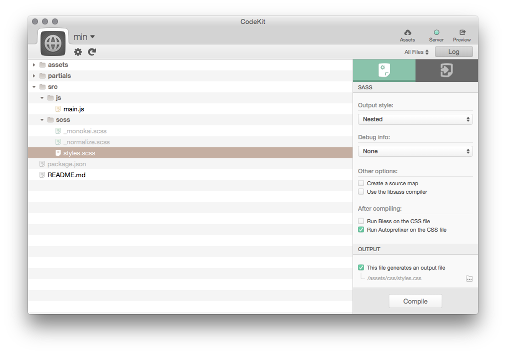
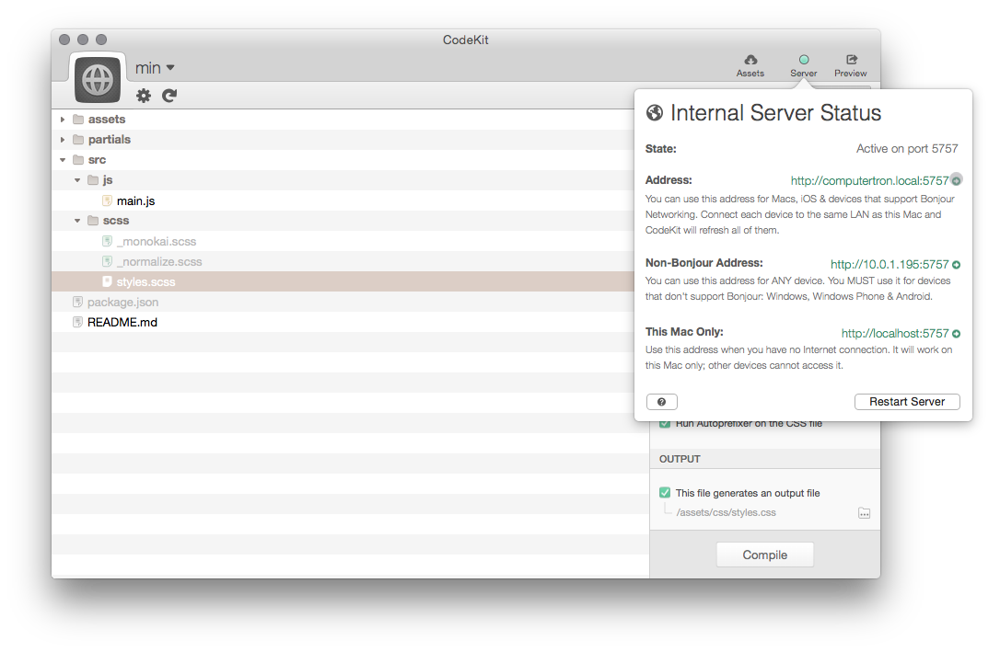
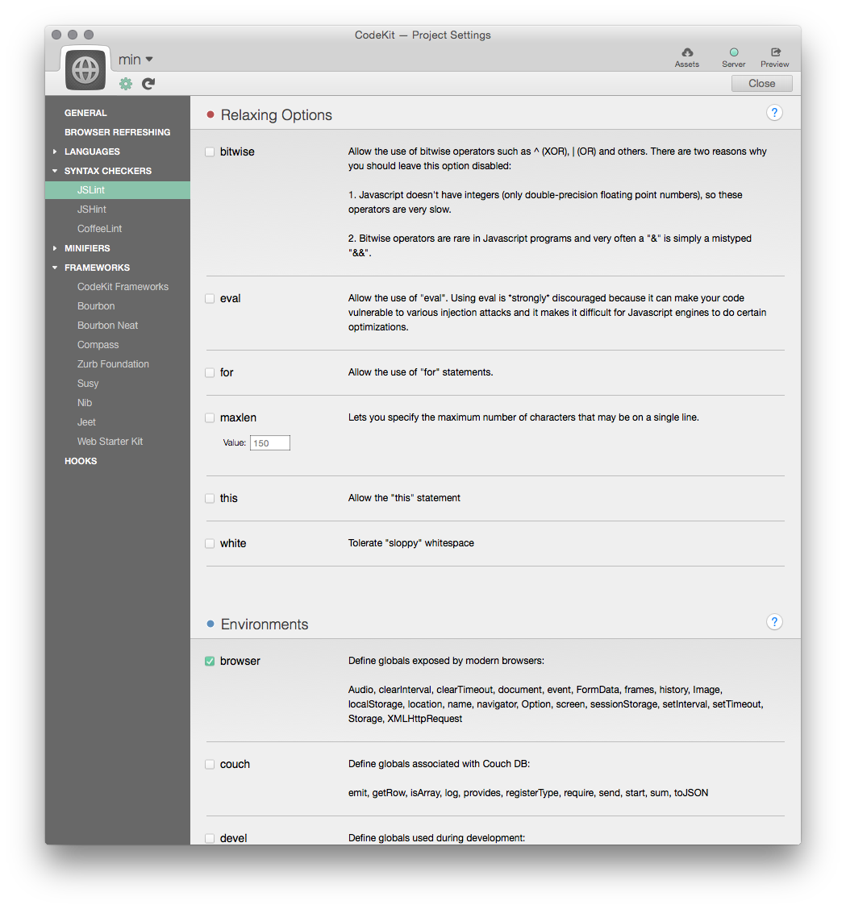
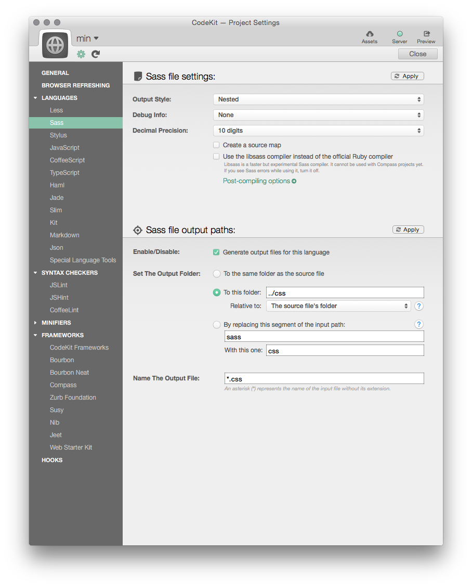

#### Update 2.3.2017:
I created a setup and walkthrough video of the features of CodeKit 3.

<iframe class="video" width="640" height="360" src="https://www.youtube.com/embed/w7mU-yGfgq0" frameborder="0" allowfullscreen></iframe>
--------
I've lived in Nashville and worked in the recording industry for the better part of a decade. One thing for sure, there is no shortage of recording engineers & musicians that have opinions on what equipment/tools are "the best". I suppose the same can be said in a lot of industries but at the end of the day, equipment, computers, software, etc are just tools. They are no different than a hammer.  

There are there are lot of front-end toolchains out there such as Webpack, Babel, Gulp, Grunt, etc. that have many of the same capabilities (and some different). While powerful and flexible, they can sometimes take a while to configure at the start of a project. In some cases, sometimes you just need to get a local webserver running and a mechanism to compile Sass to browser readable code and get rolling on a new design. For those situations, I have found [CodeKit](http://incident57.com/codekit) by the developers at Incident57 to be incredibly powerful and easy to setup.

## Development Web Server Built In
As I mentioned before, one of the nice things about CodeKit is that it comes with web server built in complete with hot reload that does not require any plugins whatsoever. Since no plugins are required, the CodeKit provided URL is accessible on mobile devices (if they are connected to the same wireless network) for previewing.

## Bower
The entire library of Bower components are available at the click of a button.

## Code Linting
Codekit comes with JSLint, JSHint and CoffeeLint built in for checking for syntax errors.

## Autoprefixer
With Sass, Less or Stylus files, browser prefixes are automatically added. No need to remember to add `-webkit`, `-moz,` or `-ms` to your CSS anymore.

## Optimization
CodeKit can combine and minify your JavaScript/CoffeeScript & Sass files to reduce the number of HTTP requests and decrease the page load time. Source Maps are also provided for easy in browser debugging. Since image assets account for the majority bandwidth of most websites, image optimization is also baked in to reduce the size of PNG and JPG images.

### Supported Languages:
* Less
* Sass
* Stylus
* JavaScript
* CoffeeScript
* TypeScript
* Haml
* Jade
* Slim
* Markdown
* JSON

