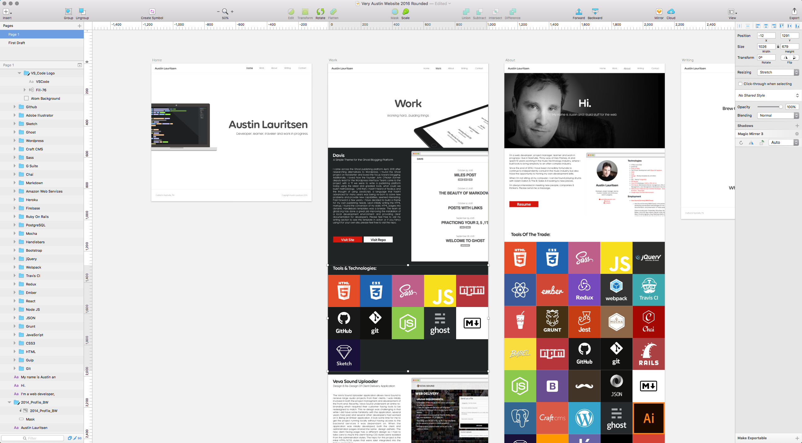
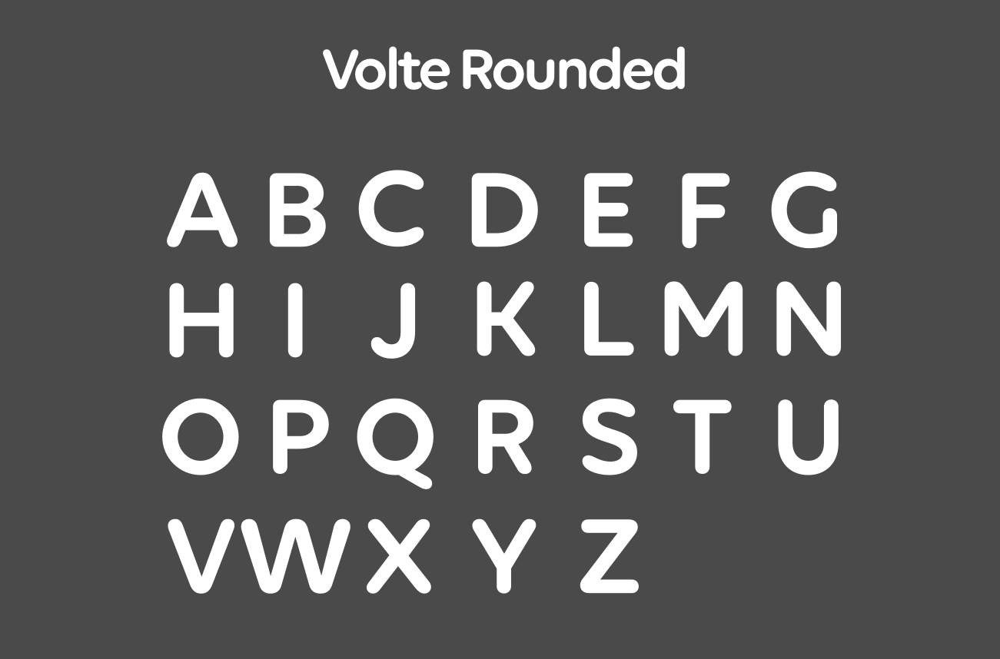
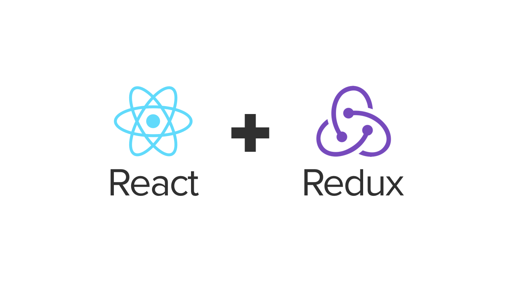

Things look a little different around veryaustin.com today and it's been a long time coming! In honor of spring, I am marking the occasion with a new website that takes advantage of some of the latest and greatest web technologies that I have been learning recently.

# Design
I have been using [Sketch App](sketchapp.com) for a year or so and have really enjoyed it's feature set. It's a powerful tool for designing both web and mobile applications and I wanted to use it for this project. I opted for a flat design incorporating tiles, reminiscent of album artwork. Having been a musician for most of my life & worked in the music industry, I have always loved the visual aesthetic of album covers. They each tell a unique story in while collectively representing the tastes of the owner.

The new design is built to translate from a website, to videos & motion graphics and social media. I opted to change my primary typeface to "Volte Rounded" in order to emit a more welcoming feeling. 

# Technology

## API
I initially started building a Rails API for the front-end to consume, I ultimately wanted focus my energy into experimenting with the new front-end tools so I built the JSON and used [Firebase](http://firebase.com) to serve it and get started on the front-end.

## React
I have been working with [React](https://facebook.github.io/react/) & [Redux](http://redux.js.org/) recently so I thought it was an excellent opportunity to apply what I have learned to a personal project. I must say I was uncomfortable when I first started learning React because it seemed to violate everything I had learned since the days of table based layouts and before CSS, that is the separation of concerns:

* HTML for content
* CSS for styling
* JavaScript for behavior

Over the years, the lines of demarcation between one language and another have been blurring ever so slowly with inline style tags in html, CSS animations for animation, etc. With the advent of React (and other JS frameworks/libraries) there seems to be more weight behind having more performant front-ends rather than one focused on pure markup correctness & separation of concerns. It's a complete 180 degree shift that is fascinating to me. With that being said, it was a bit strange for me to be writing HTML inside of JavaScript files but it didn't take long for me to see the benefits. It was very apparent that having behavior & display code of a component in one location (rather than separate in many other files) made the re-use, predictability & maintainability much simpler.

## Redux
This site not a complicated in regards to state so Redux seemed a bit of overkill. The front-end makes AJAX calls to the API for each page. Each page is stored in it's own object in the Redux store. If the page has already been navigated to, rather that making an additional API call, the page data is loaded from Redux. One day I may refactor the AJAX calls to see how making a single API call to load the entire site data load would effect the performance. My guess is that it would probably be an improvement.

## React Styled-Components
Taking this re-usable component idea further, I wondered if it was possible to bring CSS into a component rather than having all CSS styles located in one monolithic stylesheet. [Styled-Components](https://styled-components.com/) to the rescue! Styled-Components allowed my to extract the CSS for each component out of the main stylesheet and into the component itself. Styled-Components also allows for logic in CSS styles based on React props. I did find it a bit difficult to test as it adds an additional layer of abstraction to your components. Getting Jest & Enzyme to render a component correctly was a bit of a challenge and in some cases a bit hacky. It's early on and I expect Style-Components to get better and these issues ironed out. It's extremely powerful and it will be interesting to see how it progresses.

## SVG's Hooray!
All image assets are SVG's (with the exception of the 'About' banner) and are stored on a static assets server (http://static.veryaustin.com). I could have used Webpack to package up all of the image assets in the deployed app, but I wanted to see how performant React was when loading image assets from external locations. The 'Tools And Technology' tile logos are loaded SVG's loaded from the static assets server. The background color, URL of each logo asset, URL of the website & the title are loaded from JSON served from Firebase.

An example tile looks like this:

    {
      "background_color" : "#e34c26",
      "logo_url" : "http://static.veryaustin.com/api/images/tools/html_logo.svg",
      "site_url" : "https://www.w3.org/TR/html5/",
      "title" : "HTML 5"
    }

and renders this:

## Flexbox Refactor
I initially wrote the HTML & CSS without flexbox. After getting the raw HTML layouts coded I felt I should have taken advantage of flexbox as my design seemed to lend itself well to it's features. I should have done this in the first place and I'll be honest and say that it wasn't an easy decision to refactor after I had just finished building the layouts but I knew it was the right decision.

## Deployment
Rather than having a traditional Apache server hosting veryaustin.com as it has in years past, today it's powered by Amazon Web Services S3 & CloudFront. TravisCI pulls the master branch of veryaustin.com from [Github](http://github.com), runs all the Jest testing suite and builds the front-end application for production. Once successful, the build is pushed to an Amazon S3 bucket which feeds an Amazon CloudFront CDN distribution to the various data centers around the world. It's a setup I'm pretty happy with so far.

# Wrap-Up
To wrap things up, this has been a really great learning experience in a variety of areas. I've had many victories and have taken several dead end paths but nevertheless, it's part of the learning process. I set out to use as many of the latest front-end technologies I could and apply what I've been learning to build something beautiful and I'm pretty happy with how it turned out.
